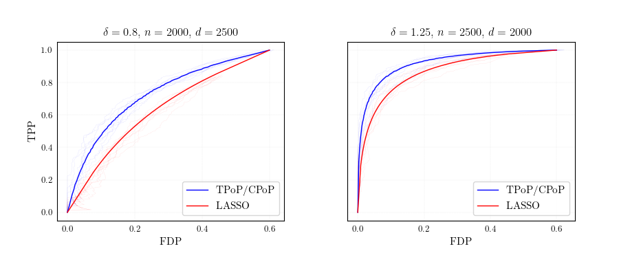
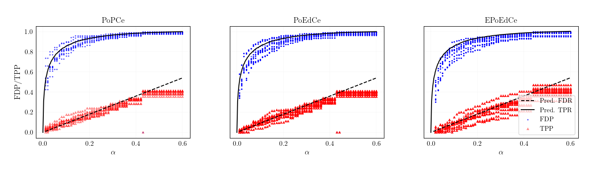

# FDR_Bayes_figures
 
This repository provides the codes used to generate figures for the paper:

**Near-optimal multiple testing in Bayesian linear models with finite-sample FDR control**.  
Taejoo Ahn, Licong Lin, Song Mei.  
Paper: https://arxiv.org/abs/2211.02778.





## Testing procedures

Our primary goal of the paper is to provide multiple-testing procedures that control FDR from finite samples and achieve near-optimal power under well-specified Bayesian linear models. We introduce 2 based procedures **TPoP** and **CPoP**, which are procedures that simply truncate the local false discovery rate (local fdr). 

Based on these two procedures, we introduce **PoPCe** and **PoEdCe**. These procedures control frequentist FDR from finite samples and achieve near-optimal power under well-specified **Bayesian linear models**. They use local fdrs as base statistics, wrap them using CRT and dCRT to generate valid p-values and e-values, then apply the eBH procedure to provide finite-sample FDR control. **EPoEdCe** is an empirical Bayes variant of **PoEdCe**.  

### Bayesian linear models

In Bayesian linear models, we have ${\bf Y}={\bf X\beta_0}+{\bf \epsilon}$ where ${\bf Y},{\bf \epsilon}\in\mathbb{R}^n$, ${\bf X}\in\mathbb{R}^{n\times d}$ and ${\bf \beta_0}\in\mathbb{R}^d$ where $\epsilon_i\sim N(0,\sigma^2)$, $X_{ij}\sim N(0,1/n)$ and $\beta_{0i}\sim\Pi$ independently, with some prior $\Pi$.

## Figure 1 and Figure 2

Figure 1 compares **TPoP** and **CPoP** with the thresholded LASSO procedure, and reports the theoretical asymptotic curves of FDP and TPP, as well as the realization of 10 simulated instances. 

Figure 2 report the FDP and TPP for **PoPCe**, **PoEdCE** and **EPoEdCe** on 10 instances of the Bayesian linear model. 

## How to use the code to generating the figures

To generate Figure 1 in the paper, simply run `fig1_data.py` to generate the data file `fig1data.npy` first. Then run `fig1_plot.py` to generate the plot `fig1.pdf`. Other figures are generated similarly. 

## Environments

```
- python==3.7.2
 - numpy==1.16.1
 - cvxpy==1.1.5
 - scipy==1.2.1
 - sklearn==0.24.1
```

## Miscellanous
  
More information about the procedures can be found in the original paper. 
If you use this code in your research, please cite our paper
```
@misc{ahn2023nearoptimal,
      title={Near-optimal multiple testing in Bayesian linear models with finite-sample FDR control}, 
      author={Taejoo Ahn and Licong Lin and Song Mei},
      year={2023},
      eprint={2211.02778},
      archivePrefix={arXiv},
      primaryClass={math.ST}
}
```

